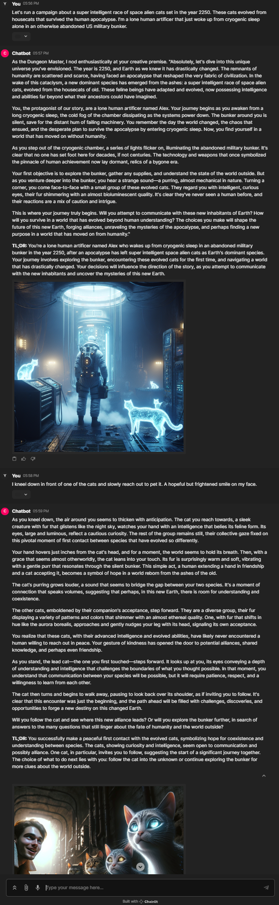

# D&D Dungeon Master

This is a simple AI Dungeon Master that can help you answer questions as if you were a Dungeon Master for a D&D campaign. The AI Dungeon Master uses the GPT-4 model to generate responses to player questions based on the context of the campaign, the history of the campaign, and the player's question.

## How to use

### Poetry

This project uses [Poetry](https://python-poetry.org/docs/#installing-with-the-official-installer) for dependency management. You can install Poetry by running the following command:

```bash
curl -sSL https://install.python-poetry.org | python3 -
```

### Installation (poetry)

```bash
make install
```

### Run

Note: You need to have the OpenAI API key to run the application. See the "Environment Variables" section below for more information.

```bash
make run
```

Navigate to [http://localhost:8000](http://localhost:8000) in your browser. Login with the username `test` and password `test`.

To use the AI Dungeon Master, simply ask a question as if you were a player in a D&D campaign. The AI Dungeon Master will generate a response based on the context of the campaign, the history of the campaign, and the player's question.

## Example



## Environment Variables

Create a `.env` file in the root directory of the project from .env.example and update the following environment variables:

### Copy .env.example to .env and update openai api key

```bash
cp .env.example .env
vi .env
```

### Example of .env file environment variables

```bash
OPENAI_API_KEY=sk-openai-api-key-here
CHAINLIT_AUTH_SECRET=sx*VSV/f~XiqV.,*lzGhWa3qp/d9z/*D6m2UEIG*DTncErh$1Su.JtH?jj@_4,nd
```

## License

This project is licensed under the Mozilla Public License 2.0 - see the [LICENSE](LICENSE) file for details.

